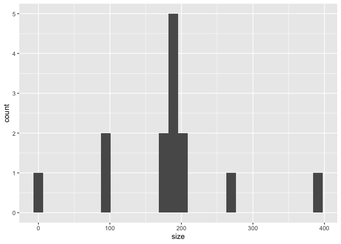

<!-- README.md is generated from README.Rmd. Please edit that file -->

# kaggling

<!-- badges: start -->
<!-- badges: end -->

The goal of kaggling is to get an overview of kaggle datasets and their
provenance.

## Installation

You can install the development version of kaggling like so:

``` r
remotes::install_github("heike/kaggling")
```

This package relies on a valid installation of `kaggle` (python 3 based
package). This includes a Kaggle account and authorization tokens for
the API. Refer to <https://github.com/Kaggle/kaggle-api> for
installation instructions.

## Basic Usage

Load the package functionality:

``` r
library(kaggling)
#> where is kaggle installed?
#> Is API use authorized? Address any warnings.
```

### Search kaggle

The main functionality is centered on searching for data sets using a
search key word:

``` r
ames <- search_kaggle("ames iowa housing")
dim(ames)
#> [1] 14  7
```

Kaggle hosts 14 data sets that are found as a result of a search on
‘ames iowa housing’.

``` r
head(ames)
#>                                                               ref
#> 1                                               marcopale/housing
#> 2 carlmcbrideellis/house-prices-advanced-regression-solution-file
#> 3                        emurphy/ames-iowa-housing-prices-dataset
#> 4               nabilabdul/ames-house-price-prediction-regression
#> 5                    zeeshanmulla/advance-house-price-predicitons
#> 6                           anishpai/ames-housing-dataset-missing
#>                                               title  size         lastUpdated
#> 1                            Ames Iowa Housing Data 397KB 2020-03-18 20:24:26
#> 2 House Prices: Advanced Regression 'solution' file   6KB 2020-09-11 15:40:17
#> 3                  Ames Iowa Housing Prices Dataset 190KB 2018-04-25 14:54:54
#> 4     🏘️Ames House Price Prediction Regression 🌎🚗🛣️  98KB 2022-07-20 12:01:40
#> 5                   Advance House Price Predicitons 274KB 2020-01-05 10:22:15
#> 6                   Ames Housing Dataset Engineered 192KB 2020-09-30 14:58:26
#>   downloadCount voteCount usabilityRating
#> 1          3450        28       0.9705882
#> 2           985        39       1.0000000
#> 3           519         9       0.4117647
#> 4           118         8       0.7941176
#> 5           780         4       0.7058824
#> 6           204         6       0.9117647
```

``` r
library(tidyverse)

# the majority of the datasets has a size of about 200 KB. 
ames %>% mutate(
  size = parse_number(size)
) %>% ggplot(aes(x = size)) + geom_histogram()
```



### Get Meta information

The data set identifier is stored in the variable `ref`.

``` r
ames$ref[1]
#> [1] "marcopale/housing"
```

Meta information is extracted from kaggle using the function `get_meta`.

``` r
# single set of meta information
get_meta(ames$ref[1])$meta
#> [[1]]
#>                  id  id_no datasetSlugNullable ownerUserNullable
#> 1 marcopale/housing 545987             housing         marcopale
#>   usabilityRatingNullable          titleNullable      subtitleNullable
#> 1               0.9705882 Ames Iowa Housing Data for Regression Models
#>                                                                                                                                                                                                                                                                                                                                                                                                                                                                                                         descriptionNullable
#> 1 ### Context\n\nThe Ames Housing dataset is a great alternative to the popular but older Boston Housing dataset.\n\n\n### Content\n\nThe Ames Housing dataset contains 79 explanatory variables describing (almost) every aspect of residential homes in Ames, Iowa with the goal of predicting the selling price.\n\n\n### Acknowledgements\n\nThe Ames Housing dataset was compiled by Dean De Cock in 2011, for use in data science education.\n\n\n### Inspiration\n\nThe Default task for this dataset is Regression.
#>   datasetId datasetSlug hasDatasetSlug ownerUser hasOwnerUser usabilityRating
#> 1    545987     housing           TRUE marcopale         TRUE       0.9705882
#>   hasUsabilityRating totalViews totalVotes totalDownloads
#> 1               TRUE      22728         28           3452
#>                    title hasTitle              subtitle hasSubtitle
#> 1 Ames Iowa Housing Data     TRUE for Regression Models        TRUE
#>                                                                                                                                                                                                                                                                                                                                                                                                                                                                                                                 description
#> 1 ### Context\n\nThe Ames Housing dataset is a great alternative to the popular but older Boston Housing dataset.\n\n\n### Content\n\nThe Ames Housing dataset contains 79 explanatory variables describing (almost) every aspect of residential homes in Ames, Iowa with the goal of predicting the selling price.\n\n\n### Acknowledgements\n\nThe Ames Housing dataset was compiled by Dean De Cock in 2011, for use in data science education.\n\n\n### Inspiration\n\nThe Default task for this dataset is Regression.
#>   hasDescription isPrivate keywords_1  keywords_2 keywords_3
#> 1           TRUE     FALSE    housing real estate regression
#>            keywords_4 licenses.nameNullable licenses.name licenses.hasName
#> 1 ratings and reviews               GPL-2.0       GPL-2.0             TRUE
```

`get_meta` expands the dataset by the list variable `meta`.

``` r
ames <- get_meta(ames)
```

``` r
ames_meta <- ames %>% tidyr::unnest(cols=meta, names_sep="_")

# There is a plethora of licenses involved
ames_meta %>% count(meta_licenses.name)
#> # A tibble: 6 × 2
#>   meta_licenses.name     n
#>   <chr>              <int>
#> 1 CC0-1.0                3
#> 2 GPL-2.0                1
#> 3 ODbL-1.0               1
#> 4 copyright-authors      1
#> 5 reddit-api             1
#> 6 unknown                7
```

<!--
Unfortunately, neither of these 35 very similar looking data files mention ISU StatCom or Dean De Cock's 2011 paper [Ames, Iowa: Alternative to the Boston Housing Data as an End of Semester Regression Project](https://www.tandfonline.com/doi/epdf/10.1080/10691898.2011.11889627?needAccess=true) in the Journal of Statistics Education.
&#10;https://jse.amstat.org/v19n3/decock/AmesHousing.txt
https://jse.amstat.org/v19n3/decock/DataDocumentation.txt
&#10;-->
